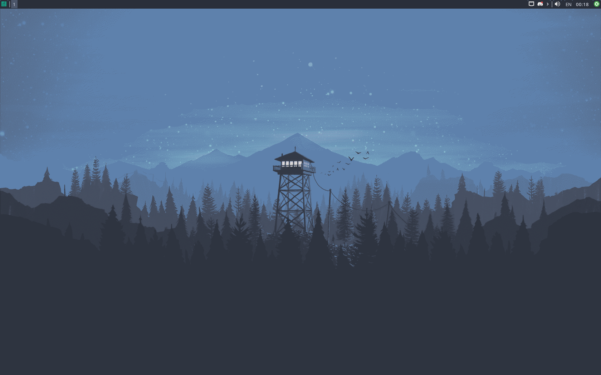
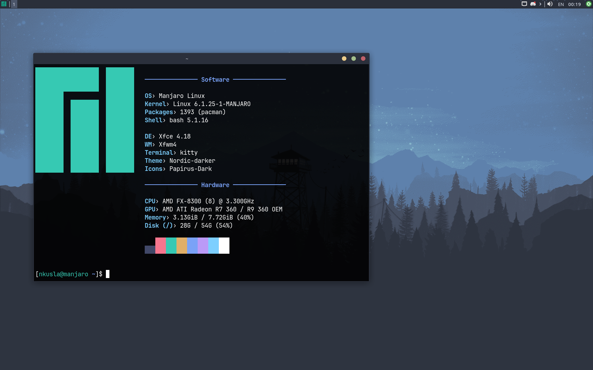

# My dotfiles

Just my dotfiles for Manjaro running xfce4 desktop environment. Nothing special...

## Setup

Repository is intended to be setup as `bare` git repository. This can be done by following these commands:

```
cd $HOME
mkdir -p .dotfiles
cd .dotfiles
git clone --bare git@github.com:nkusla/dotfiles.git .
alias dotfiles='/usr/bin/git --git-dir=$HOME/.dotfiles --work-tree=$HOME'
dotfiles config --local status.showUntrackedFiles no
dotfiles reset --hard
```

**WARNING:** this will overwrite existing configuration files. If you don't want exisitng files to be overwritten, back them up.

After cloning repository you can run following commands which will setup LightDM and install additional packages:
```
sudo .scripts/init.sh
sudo .scripts/install.sh
```

## Screenshots


